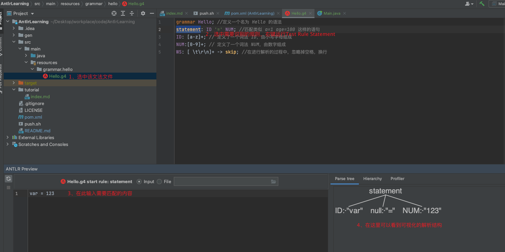

# Antlr
> Antlr （ANother Tool for Language Recognition）

# 学习资料
- https://xie.infoq.cn/article/da3cc0f7c30a87f727d5116ff
- https://xie.infoq.cn/article/a087bc9d8f28e5f6836822759
- https://blog.csdn.net/qq_36616602/article/details/85858133

# Antlr是什么
> 设计良好的语法反应了编程世界中的功能分解或者自顶向下的设计。
> 这意味着我们对语言结构的辨识是从最粗的粒度开始，一直进行到最详细的层次，并把它们编写成为语法规则。

# 安装
- 添加maven依赖
- 安装IDEA插件 ANTLR V4
- 使用插件可视化解析

  
# 设计模式
## 观察者模式
## 访问者模式